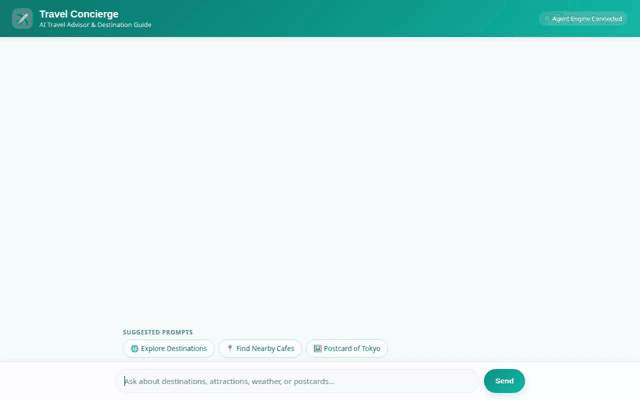

# Travel Concierge — AI Travel Advisor & Destination Guide

An intelligent, multi-modal AI Travel Concierge built with the **Google Agent Development Kit (ADK)** and deployed on **Google Cloud Agent Platform**. It acts as a personal travel advisor, helping users explore destinations, discover local venues, generate destination postcards & video clips, estimate travel budgets, and provide personalized recommendations backed by long-term user memory.



---

## Key Features & Implemented Capabilities

- **Destination Catalog & Database Management (Cloud Firestore)**: Query, view details, and add travel destinations stored in a managed Firestore database.
- **Multimodal Image Generation (Gemini 3.1 Flash Lite)**: Generate high-quality destination photo previews and postcards uploaded directly to a public Cloud Storage bucket and surfaced as Playground artifacts.
- **Multimodal Video Generation (Gemini Omni Flash)**: Generate short video clips of travel destinations using `gemini-omni-flash-preview` in the global region.
- **Cross-Session Long-Term Memory (Vertex AI Memory Bank)**: Automatically retains user preferences, travel styles, dietary restrictions, and allergies across sessions to personalize future recommendations.
- **Rich UI Renderings (A2UI)**: Emits structured A2UI cards for destination summaries, venue cards, and inline imagery rendered directly in the custom web chat frontend.
- **Location & Venue Discovery (Google Maps API)**: Geocode destination addresses and discover nearby restaurants, cafes, museums, and attractions with coordinates.
- **Live Currency Conversion**: Perform instant exchange rate calculations for global travel budgeting.
- **Secure Code Execution Sandbox**: Execute Python scripts in an Agent Engine sandbox for complex itinerary calculations and budget estimations.

---

## Architecture & Google Cloud Integration

- **Agent Framework**: Google Agent Development Kit (ADK) `google.adk.agents.Agent`
- **LLM Engine**: `gemini-flash-latest` via Vertex AI
- **Memory Service**: Vertex AI Memory Bank (`PreloadMemoryTool` + `add_session_to_memory` callback)
- **Database**: Google Cloud Firestore (`destinations` collection)
- **Object Storage**: Google Cloud Storage (`travel-concierge-media-*` bucket)
- **Multimodal Models**:
  - Image: `gemini-3.1-flash-lite-image` (Global Region)
  - Video: `gemini-omni-flash-preview` (Global Region, Interactions API)
- **Code Execution**: Agent Engine Sandbox Code Executor (`AgentEngineSandboxCodeExecutor`)
- **Frontend Architecture**: FastAPI proxy talking A2A protocol (`a2a-sdk`) to Agent Engine with a modern web interface.

---

## Repository Structure

```
travel-concierge/
├── app/                        # Agent backend logic & tool definitions
│   ├── agent.py                # Main ADK root agent configuration & system prompt
│   ├── firestore_tools.py      # Firestore search & destination CRUD tools
│   ├── image_tools.py          # Vertex AI image generation & Cloud Storage upload
│   ├── video_tools.py          # Vertex AI video generation (gemini-omni-flash-preview)
│   ├── maps_tools.py           # Google Maps geocoding & nearby places tools
│   ├── currency_tools.py       # Live currency exchange rate calculation tool
│   └── a2ui_utils.py           # A2UI card renderer & callback handlers
├── frontend/                   # Web frontend & A2A proxy server
│   ├── main.py                 # FastAPI proxy server using a2a-sdk
│   ├── static/index.html       # Single-page web chat UI with A2UI support
│   └── Dockerfile              # Container spec for Cloud Run deployment
├── agents-cli-manifest.yaml    # Deployment manifest for agents-cli
├── deployment_metadata.json    # Deployed Agent Engine resource details
├── demo.gif                    # Recorded UI demonstration walkthrough
└── README.md                   # Project documentation
```

---

## Local Setup & Running Instructions

### Prerequisites
- Python 3.11+
- Node.js & npm
- Google Cloud SDK (`gcloud`) authenticated with Application Default Credentials (`gcloud auth application-default login`)

### 1. Install Agent Backend Dependencies
```bash
pip install -r requirements.txt
```

### 2. Start the Local Frontend Proxy
Navigate to the `frontend/` directory, set your deployed Agent Engine resource name, and launch the FastAPI server:

```bash
cd frontend
pip install -r requirements.txt

export AGENT_ENGINE_RESOURCE_NAME="projects/<YOUR_PROJECT_ID>/locations/us-east1/reasoningEngines/<ENGINE_ID>"
export AGENT_DIRECTORY="app"

python main.py
```
The web chat application will start on local port `8080`.

---

## Deployment & Production Hosting Guide

When deploying this project to production on Google Cloud, keep the following key steps and permissions in mind:

### 1. Deploying the Agent Backend (Agent Engine)
Deploy the agent logic in `app/` to Vertex AI Agent Runtime:
```bash
agents-cli deploy --target agent_runtime
```
This provisions a Reasoning Engine resource name (e.g., `projects/<PROJECT_ID>/locations/us-east1/reasoningEngines/<ENGINE_ID>`).

### 2. Deploying the Frontend (Google Cloud Run)
Build and deploy the FastAPI proxy container from `frontend/`:
```bash
cd frontend
gcloud run deploy travel-concierge-frontend \
  --source . \
  --region us-east1 \
  --allow-unauthenticated \
  --set-env-vars AGENT_ENGINE_RESOURCE_NAME="projects/<YOUR_PROJECT_ID>/locations/us-east1/reasoningEngines/<ENGINE_ID>",AGENT_DIRECTORY="app"
```

### 3. Essential IAM Permissions & Cloud Services
Ensure the relevant service accounts have the required roles:
- **Agent Service Account** (Reasoning Engine):
  - `roles/datastore.user` (to query & write to Firestore `destinations`)
  - `roles/storage.objectAdmin` (to upload generated images and videos to GCS)
  - `roles/aiplatform.user` (to call Vertex AI multimodal models)
- **Cloud Run Service Account**:
  - `roles/aiplatform.user` (to allow browser/proxy requests to communicate with the Agent Engine via A2A protocol)
- **GCP APIs to Enable**:
  - `aiplatform.googleapis.com`, `firestore.googleapis.com`, `storage.googleapis.com`, `run.googleapis.com`

---

## Planned / Future Features (Not Yet Implemented)

- **Automated Weather API Integration**: Live weather API integration beyond simulated updates.
- **Flight & Hotel Booking API**: Real-time flight and hotel reservation booking integrations.
